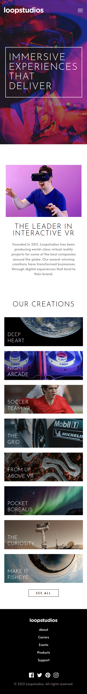
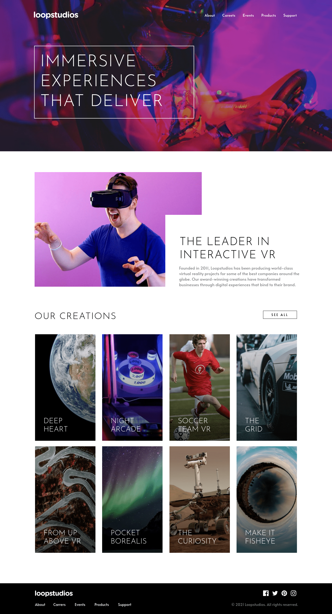

# Frontend Mentor - Loopstudios landing page solution - Rufi512

## Table of contents

- [Overview](#overview)
  - [The challenge](#the-challenge)
  - [Screenshots](#screenshots)
  - [Links](#links)
- [My process](#my-process)
  - [Built with](#built-with)
- [Author](#author)

## Overview

### The challenge 

Users should be able to:

- View the optimal layout for the site depending on their device's screen size
- See hover states for all interactive elements on the page

### Screenshots

(**425px** - **1440px**) Width

| Mobile Design | Mobile Solution | 
|--|--|
|  |  |

| Desktop Design | Desktop Solution  | 
|--|--|
|   |   |

### Links

- Solution URL: [FrontendMentor Solution](https://www.frontendmentor.io/solutions/loopstudioslandingpagehtmlcssjswebpack-PdH75Myqi)

- Live Site URL: https://rufi512.github.io/loopstudios-landing-page/

## My Process

### Built with

 - HTML (Lifelong)
 - CSS - Flexbox - Grid
 - Javascript
 - Webpack (To manage packages and more)

## Author

- Frontend Mentor - [@Rufi512](https://www.frontendmentor.io/profile/Rufi512)
- Twitter - [@Rufi512](https://twitter.com/rufi512)
